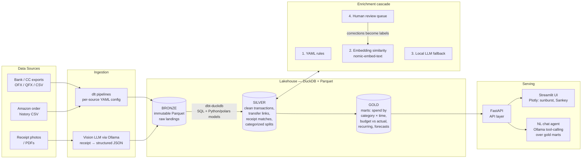

# Architecture

> Bird's-eye view of the personal-finance platform: a **local-first lakehouse with an app on top**.
> Companion docs: [FEATURES.md](./FEATURES.md) (what we're building) and [PLAN.md](./PLAN.md) (in what order).

---

## Design principles

1. **Local first.** All financial data is processed on the user's machine. LLM inference runs
   through locally hosted models via Ollama. No financial data ever leaves the machine.
2. **Framework focused.** Use robust open-source frameworks (DuckDB, dbt, dlt, Dagster, Plotly,
   Ollama) rather than reinventing pipelines, lineage, or visualization.
3. **Lakehouse + medallion.** Immutable raw data (bronze) → cleaned & enriched (silver) →
   query-ready marts (gold). Every gold number is traceable to a raw source file.
4. **Configuration over code.** Sources, category taxonomy, matching rules, and budgets are
   YAML the user can edit (eventually from within the app), validated by Pydantic models.
5. **Deterministic guardrails for agentic development.** dbt data tests, pytest, ruff, and ty
   make correctness machine-checkable. ML/LLM components always sit behind deterministic
   rules first and a human review queue last.
6. **Dummy data only** until the platform is proven. `personal_finance.synth` generates
   realistic fixtures matching real export schemas; real data never enters the repo.

---

## System diagram



Transformations bronze → silver → gold are **dbt-duckdb** models: SQL for shape,
Python models (polars) for fuzzy matching, embeddings, and other logic awkward in SQL.
dbt provides data tests and auto-generated lineage docs. Orchestration is CLI-first
(`pf ingest`, `pf transform`, `pf enrich`), with **Dagster** adopted in the automation
phase — its software-defined assets map 1:1 onto dlt sources and dbt models.

---

## Component choices and rationale

| Concern | Choice | Why (and what we rejected) |
|---|---|---|
| Analytical store | **DuckDB** | Single-file, columnar, fast, native Parquet, at-rest encryption (≥1.4). Rejected Postgres (wrong weight class for local single-user). |
| Bronze storage | **Parquet files on disk** | Immutable, replayable lakehouse landing zone; DuckDB queries it natively. Rejected Delta Lake format: multi-writer ACID / time travel / Spark interop are unused locally; delta-rs adds moving parts without benefit here. |
| Transformations | **dbt-duckdb** (SQL + Python/polars models) | Declarative + YAML-configured, built-in data tests (agent guardrails), lineage documentation (portfolio). polars lives inside Python models for the ML-ish steps. Rejected SQLMesh (less recognizable), bare pandas scripts (no tests/lineage). |
| Ingestion | **dlt** | Declarative per-source pipelines, schema evolution, tiny code per source. |
| Receipt parsing | **Vision LLM via Ollama** (e.g. Qwen2.5-VL) | Photo → structured JSON in one step. Rejected Tesseract/PaddleOCR + parser: strictly worse pipeline in 2026. |
| Categorization | **Cascade:** YAML rules → embedding similarity (nomic-embed-text) → local LLM → human review queue | Explainable, user-editable, improves from corrections. Rejected single end-to-end ML model (opaque, cold-start problem). |
| Transfer detection | **Deterministic heuristics** (dbt model) | Amount negation + date window + account pair. No ML needed; fully testable. |
| Orchestration | **CLI first, Dagster later** | Dagster's asset graph = the lineage graph; far lighter than Airflow in Docker. Deferred until automation phase to avoid early ceremony. |
| API layer | **FastAPI + Pydantic** | Decouples warehouse from any UI; matches repo conventions. |
| UI | **Streamlit + Plotly** first; React upgrade path via the API | Sunburst & Sankey are first-class Plotly charts; sunburst is the natural rendering of the hierarchical taxonomy. UI is swappable because gold marts + FastAPI are the contract. |
| BI (optional) | **Apache Superset** (dockerized, phase 8) | Optional "power analyst" service over the same gold layer. Not the primary UI: heavyweight (metadata DB, Redis, auth) and can't compose with chat/review-queue interactions. |
| NL chat | **Ollama tool-calling agent** over governed gold-mart queries | Tools are curated queries/metrics, not open text-to-SQL against the whole DB — safer and more reliable. |
| Forecasting | **statsforecast** (Nixtla) | Fast, local, CPU-only. Recurring detection is heuristic (dbt model), not ML. |
| Runtime | **Docker Compose** | `ollama`, `api`, `ui`, later `dagster` (+ optional `superset`). Isolated network; nothing egresses financial data. |

---

## Core schema (conceptual)

```
accounts            one row per financial account (bank, CC, Venmo, ...)
transactions        one row per statement/export line
transaction_splits  line items — a receipt decomposes one transaction into N splits;
                    unsplit transactions get a single implicit split
categories          self-referential hierarchy, seeded from YAML taxonomy
                    (apples → groceries → essentials)
merchants           normalized merchant entities (raw descriptor → clean name)
documents           receipts and other source artifacts (image, parsed JSON, status)
links               correlation edges: transfer pairs (Venmo +320 / bank −320),
                    receipt ↔ charge matches
budgets             budget buckets, keyed to category subtrees + period
labels              human corrections from the review queue; training data for
                    the embedding classifier
```

Splits are what make "how much have I spent this year on apples" answerable while
"how much did I spend last week" stays a trivial rollup. Schema patterns are borrowed
from Firefly III and Actual Budget (battle-tested transaction/split/transfer models).

Referential integrity is enforced by dbt relationship tests and application logic,
not declared FOREIGN KEYs: DuckDB runs UPDATEs on FK-involved tables as
DELETE + INSERT, so updating any referenced row (a parent category, a transaction
with splits) would raise over-eager constraint violations. Category identity is a
deterministic UUIDv5 of the taxonomy path, making taxonomy seeding an idempotent
upsert that never touches user-authored ``note`` values.

---

## Security posture

- All processing local; Ollama for all inference on financial data.
- Docker Compose network isolation; no service exposes ports beyond localhost.
- Secrets/config in `.env.local` (gitignored); `.env.example` is the template.
- DuckDB at-rest encryption enabled in the hardening phase.
- Dummy data (`personal_finance.synth`) for all development, tests, demos, and
  screenshots — real data is a deliberate, later, local-only opt-in.

## Data source strategy

Exports first, no Plaid (antithetical to local-first):

1. **Backbone:** bank/CC OFX/QFX/CSV exports — file upload or watch-folder.
2. **Enrichment:** Amazon order-history CSV export; receipt photos via vision LLM.
3. **Later:** email receipt parsing (IMAP, local); **SimpleFIN Bridge** if automatic
   bank sync is ever wanted (privacy-respecting, unlike Plaid).
